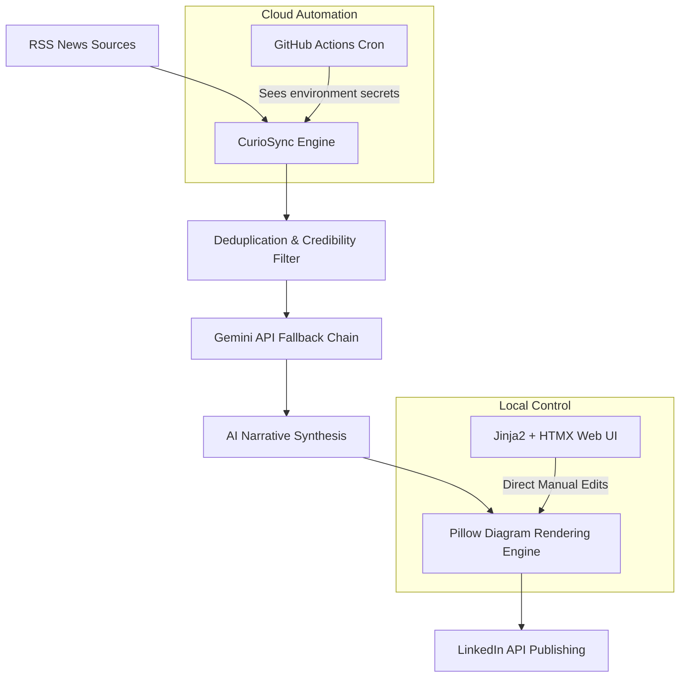

# ⚡ CurioSync: Serverless Tech News & LinkedIn Publisher

CurioSync is a production-ready, self-hosted Python/FastAPI automation system that curates the day's top tech stories, programmatically renders high-engagement visual branding card graphics, and automatically publishes a refined summary post to LinkedIn.

Designed for engineering leaders and content creators, it operates **100% free of hosting costs** using a stateless GitHub Actions runner and an in-memory SQLite database, eliminating the need to maintain a persistent 24/7 server.

---

## 🚀 Key Features

* **Serverless Daily Automation** — Run completely free using a GitHub Actions cron schedule. Seeding an in-memory database at runtime enables stateless, host-independent executions.
* **Smart Content Curation** — Fetches top stories across 6 major tech RSS streams (TechCrunch, Ars Technica, Wired, BBC Tech, etc.) and deduplicates near-identical articles using fuzzy title comparison (SequenceMatcher).
* **AI-Powered Synthesis & Storytelling** — Condenses headlines into structured, senior-level narrative summaries that organically connect today's tech topics to your personal database sync and PostgreSQL accomplishments, referencing your graduate studies at Arizona State University and five years of experience.
* **Programmatic Diagram Graphic** — Uses Pillow to dynamically analyze post context and render a custom, high-engagement technical diagram (flowchart, comparison grid, or systems architecture map) complete with your branding and credentials.
* **Jinja2 + HTMX Local Dashboard** — A premium glassmorphism command center for local review, manual draft edits, real-time visual graphic previews, and direct publishing.
* **Robust Compliance & Humanizer** — Scans drafts for robotic phrases, checks character boundaries for LinkedIn's API limits, and verifies that no credential or data scraping terms are included.

---

## 🛠️ Architecture & Tech Stack



| Component | Technology |
|---|---|
| **Language & Framework** | Python 3.11+, FastAPI |
| **Frontend Integration** | Jinja2 Templates, HTMX, Vanilla CSS (Glassmorphism) |
| **Database** | SQLite (async via aiosqlite), SQLAlchemy 2.0 ORM |
| **Asset Engine** | Pillow (PIL) for diagram/infographic generation |
| **Security & OAuth** | Cryptography (Fernet symmetric encryption), LinkedIn OAuth 2.0 |
| **Quality Verification** | pytest, pytest-asyncio (74/74 test cases verified) |

---

## 📦 Setup & Installation

### 1. Local Development Setup
Clone the repository and install the dependencies inside a Python virtual environment:
```bash
python -m venv venv
# On Windows PowerShell:
.\venv\Scripts\activate
# On macOS/Linux:
source venv/bin/activate

pip install -r requirements.txt
```

### 2. Configure Environment Variables
Copy `.env.example` to `.env` and fill in your actual credentials:
```bash
copy .env.example .env
```
Generate your Fernet encryption key:
```bash
python -c "from cryptography.fernet import Fernet; print(Fernet.generate_key().decode())"
```

### 3. Start the Web App
Run the local FastAPI server using Uvicorn:
```bash
uvicorn app.main:app --reload
```
Open **[http://localhost:8000](http://localhost:8000)** to connect your LinkedIn profile, fetch today's headlines, customize your posts, and see your graphic previews in real time.

---

## ☁️ Setting Up GitHub Actions (Free Cloud Execution)

You do not need to host a database or keep your personal computer turned on. Run the publisher daily on GitHub's free runners:

1. **Get Credentials from Local Dashboard:** 
   Start your local server, authenticate with LinkedIn, expand the **🚀 Deploy to GitHub Actions (Free)** accordion, and copy:
   * `LINKEDIN_SUB_URN`
   * `LINKEDIN_ACCESS_TOKEN`
2. **Add Repository Secrets to GitHub:**
   In your repository page, navigate to **Settings > Secrets and variables > Actions** and add these secrets:
   * `LINKEDIN_SUB_URN` (Pasted Sub URN)
   * `LINKEDIN_ACCESS_TOKEN` (Pasted token)
   * `GEMINI_API_KEY` (Your Google AI Studio API Key)
3. **Trigger workflow:**
   The action is configured in `.github/workflows/daily_post.yml` to run daily at **13:00 UTC (6:00 AM MST / America/Phoenix timezone)**. You can also manually trigger it by clicking **Run workflow** under the repository's **Actions** tab.

> [!IMPORTANT]
> **Token Expiry Notice:**
> LinkedIn access tokens expire every 60 days. Once every 2 months, run the local app, log in to refresh, copy the new token from the dashboard, and update `LINKEDIN_ACCESS_TOKEN` on your GitHub repository secrets.

---

## 🧪 Running the Test Suite
Ensure all services, API routers, model chains, and rendering pipelines are functioning correctly:
```powershell
$env:PYTHONPATH="."
.\venv\Scripts\pytest tests/ -v
```

---

## 📄 License
This project is licensed under the MIT License.
